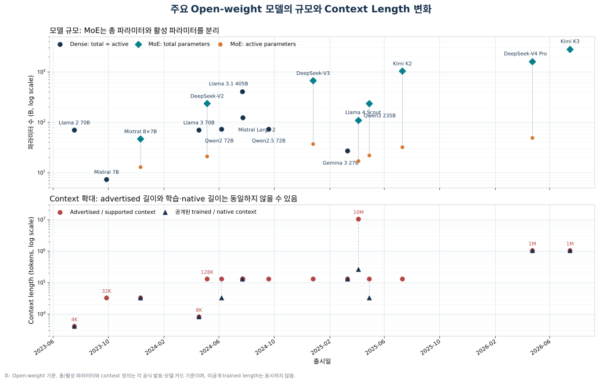
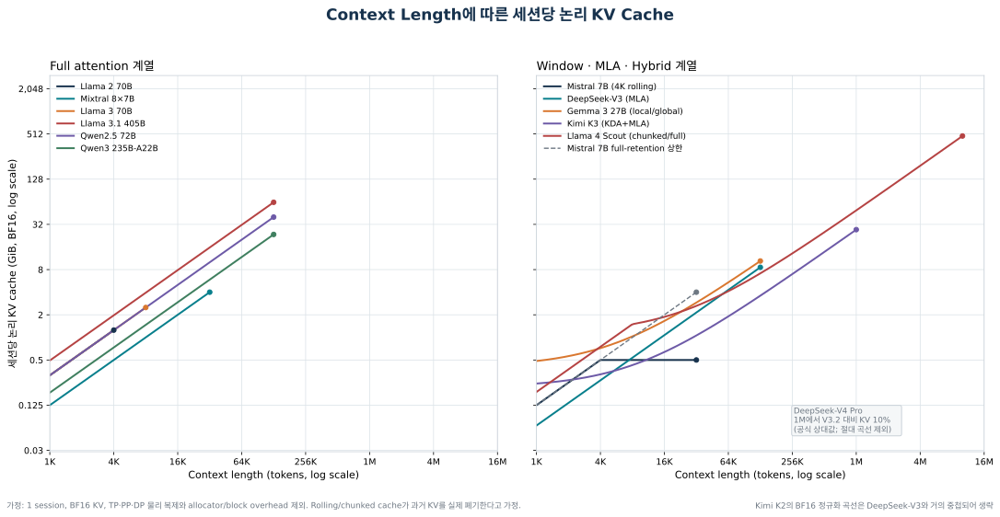
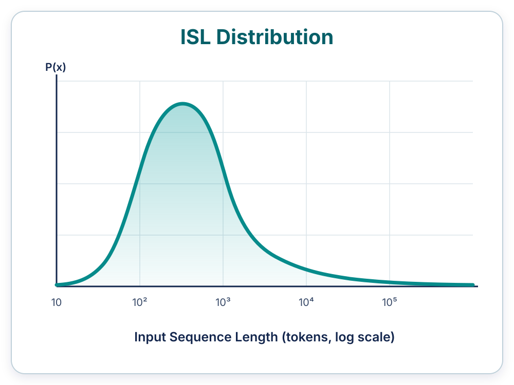
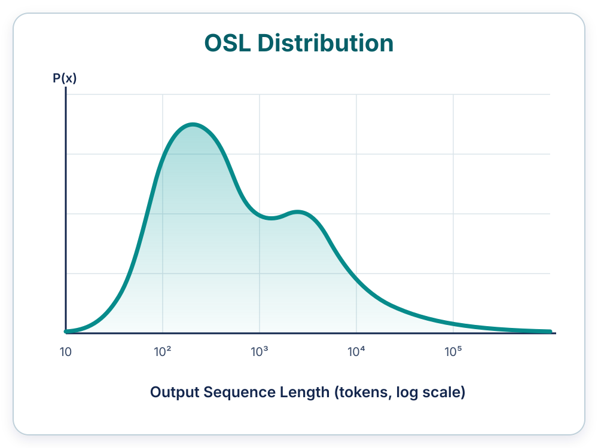
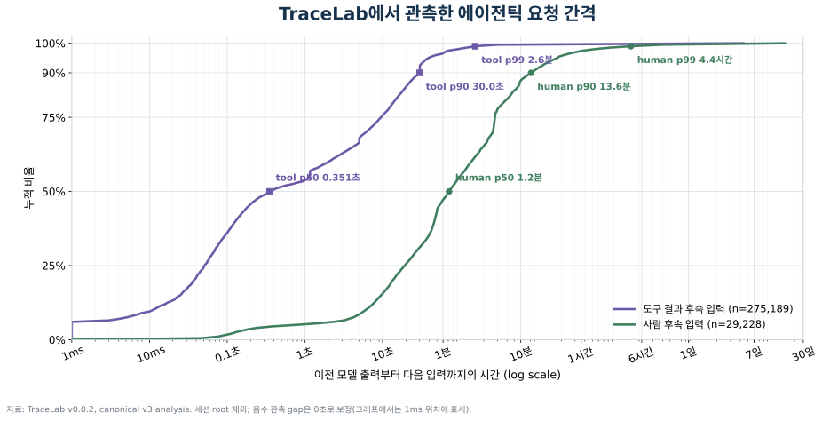

# 제1장. 개발 배경 및 필요성

생성형 AI가 서비스 운영 단계로 확산되면서 추론 인프라의 중요성이 커지고 있다. 추론 시스템은 서비스 운영 기간에 지속적으로 요청을 처리하므로 응답 지연, 처리량, 운영 비용 및 확장성에 직접적인 영향을 미친다. 이에 따라 AI 인프라 설계의 검토 범위도 모델의 실행 가능 여부에서 변화하는 요청을 얼마나 효율적으로 처리할 수 있는지로 확대되고 있다.

특히 대규모 언어 모델(Large Language Model, LLM)의 추론에서는 모델 가중치뿐 아니라 사용자별 대화 문맥을 유지하기 위한 KV 캐시(KV cache)가 메모리를 점유한다. KV 캐시 사용량은 모델 구조, 입력·출력 길이, 동시 사용자 수, 요청 간 간격 및 시스템 운영 방식에 따라 달라진다. 따라서 고객 워크로드에 적합한 메모리 사양을 결정하려면 단순한 모델 크기 계산을 넘어 요청과 캐시의 상태 변화를 시간축에서 분석해야 한다.

본 장에서는 이러한 변화가 기존의 정적 용량 산정 방식으로 다루기 어려운 이유와 시뮬레이션 기반 분석 체계의 개발 필요성을 정리한다.

## 1.1 추론 시스템의 중요성이 커지고 있다

생성형 AI 서비스에는 짧은 질의응답부터 긴 문서 분석, 코드 생성, 다중 턴 대화 및 에이전트 작업까지 다양한 요청이 지속적으로 유입된다. 트래픽의 규모와 형태도 시간에 따라 달라지므로 추론 인프라는 변화하는 수요를 안정적으로 수용해야 한다.

LLM 추론 시스템은 모델 가중치와 함께 각 요청의 문맥을 유지하기 위한 KV 캐시를 관리한다. KV 캐시를 보존하면 이전 문맥의 재계산을 줄일 수 있지만 그만큼 메모리를 계속 점유한다. 따라서 메모리 용량과 대역폭은 동시 처리량, 응답 지연 및 운영 효율을 결정하는 핵심 자원이다.

추론 시스템의 메모리 요구량은 하드웨어 사양만으로 결정되지 않는다. 같은 모델과 장비를 사용하더라도 다음 조건에 따라 실제 요구량과 성능이 달라진다.

- 동시 사용자 수
- 요청별 입력·출력 길이
- 동일 사용자의 요청 간 간격
- 캐시 보존 및 제거 기준
- 요청과 메모리의 배치·관리 방식

즉 추론 메모리 문제는 단순한 최대 용량 계산이 아니라, **모델·워크로드·시스템 정책이 결합된 동적 자원 관리 문제**다. 최근에는 모델 구조와 서비스 사용 방식이 동시에 빠르게 바뀌면서 이 문제의 복잡성이 더욱 커지고 있다.

## 1.2 첫 번째 변수 — 모델과 컨텍스트 길이가 빠르게 변한다

메모리 요구량을 산정하기 어려운 첫 번째 이유는 모델 규모, 지원 컨텍스트 길이(context length) 및 어텐션 구조가 동시에 변하기 때문이다. 주요 가중치 공개(open-weight) 모델의 사양을 출시일 순으로 정리하면 2023년의 4K~32K급 컨텍스트가 2024년에는 128K급으로 확대되었고, 2025~2026년에는 1M~10M을 지원하는 모델이 등장했다. 모델 규모도 밀집(dense) 모델의 단순 확대뿐 아니라 일부 전문가(expert)만 활성화하는 MoE 방식으로 총 파라미터 수와 활성 파라미터 수가 분리되는 방향으로 변화하고 있다.[^open-model-study]



> **그림 1-1.** 주요 가중치 공개 모델의 출시일별 파라미터 수와 컨텍스트 길이 변화. MoE 모델은 총 파라미터와 활성 파라미터를 구분하였으며, 지원 컨텍스트와 공개된 학습 기준 컨텍스트가 다른 경우에는 두 값을 함께 표시하였다.

그림 1-1의 컨텍스트 길이는 모델이 처리할 수 있다고 공개한 최대 길이를 비교한 값이다. 그러나 이 값만으로 실제 서비스의 메모리 요구량을 판단할 수는 없다. 같은 컨텍스트 길이를 지원하더라도 문맥을 표현하고 보존하는 방식에 따라 세션당 KV 캐시의 크기와 증가 형태가 달라지기 때문이다.

그림 1-2는 이러한 차이를 비교하기 위해 주요 모델의 세션당 논리 KV 상태량을 동일한 BF16 기준으로 환산한 결과다. 실제 장비의 물리 메모리 사용량은 배치 방식과 소프트웨어 구현에 따라 달라질 수 있으므로, 모델 구조에 따른 상대적 차이와 증가 추세를 중심으로 해석해야 한다.



> **그림 1-2.** 컨텍스트 길이에 따른 세션당 논리 KV 캐시. 동일한 컨텍스트에서도 모델 구조에 따라 수 GiB에서 수십 GiB 이상의 차이가 나타나며 증가 곡선의 형태도 서로 다르다.

그림에서 보듯이 컨텍스트 길이가 128K로 같아도 모델별 논리 KV 캐시는 약 8.6 GiB에서 63 GiB까지 차이를 보인다. 또한 더 긴 컨텍스트를 지원하는 최신 모델이 항상 더 작은 KV 캐시를 요구하는 것도 아니다. 결국 최대 컨텍스트 길이나 총 파라미터 수만으로 메모리 수요를 예측하기 어려우며, 모델 세대가 바뀔 때마다 영향을 다시 평가해야 한다. 모델별 구조와 계산 방식은 제2장에서 설명한다.

## 1.3 두 번째 변수 — 사용자 요청은 평균으로 대표되지 않는다

두 번째 변수는 요청 길이의 분포다. 실제 생성형 AI 서비스에는 짧은 질문뿐 아니라 긴 문서 입력, 대규모 코드 분석, 다중 문서 검색 및 수십 회의 대화를 이어가는 요청이 함께 존재한다. 입력 길이(Input Sequence Length, ISL)와 출력 길이(Output Sequence Length, OSL)는 평균 주변에 모이기보다 일부 매우 긴 요청이 오른쪽 꼬리를 형성하는 롱테일 분포를 보이는 경우가 많다.

ISL과 OSL은 서로 다른 방식으로 메모리 압력을 만든다.

- 긴 ISL은 요청이 도착하는 시점부터 많은 KV 캐시를 필요로 한다.
- 긴 OSL은 응답을 생성하는 동안 KV 캐시와 메모리 점유 시간을 늘린다.
- 여러 개의 긴 요청이 동시에 활성화되면 순간적인 메모리 사용량과 처리 대기가 함께 증가한다.



> **그림 1-3.** 입력 길이의 롱테일 분포를 설명하기 위한 개념도. 실제 측정 데이터가 아니라 분포의 형태를 나타낸다.



> **그림 1-4.** 출력 길이의 롱테일 분포를 설명하기 위한 개념도. 실제 측정 데이터가 아니라 분포의 형태를 나타낸다.

평균값만으로 시스템을 설계하면 긴 요청이 동시에 유입될 때 필요한 메모리를 과소평가할 수 있다. 메모리 부족을 유발하는 요인은 평균 요청 자체가 아니라 긴 요청의 비율과 이들이 겹치는 방식이기 때문이다. 반대로 최장 요청과 최대 동시성을 기준으로 용량을 산정하면 대부분의 운영 시간에 사용되지 않는 메모리까지 포함하게 된다.

따라서 평균값과 이론적 최악값 중 하나를 선택하는 방식으로는 적정 용량을 결정하기 어렵다. 요청 길이의 전체 분포, 순간 동시성 및 시스템의 처리 과정을 함께 고려하여 비용과 서비스 수준 목표(Service Level Objective, SLO)를 만족하는 운용 지점을 찾아야 한다. 평균값을 사용하는 정적 계산만으로는 개별 요청이 시간에 따라 겹치면서 만드는 메모리 압력과 지연을 충분히 재현할 수 없다.

## 1.4 세 번째 변수 — 에이전틱 AI에서는 요청 간 간격도 중요하다

세 번째 변수는 동일 세션에서 발생하는 요청 간 간격이다. 에이전틱 AI는 하나의 작업을 완료하기 위해 다음과 같은 과정을 반복한다.

```text
계획 수립 → 모델 호출 → 도구 실행 → 결과 확인 → 후속 호출 또는 재시도
```

후속 요청은 이전 요청이 완료된 직후에 도착할 수도 있고, 사용자의 판단, 도구 실행, 외부 API 응답 또는 승인 대기로 인해 수분에서 수십 분 뒤에 도착할 수도 있다. 이 간격은 단순한 트래픽 특성이 아니라 이전 대화의 KV 캐시를 얼마나 오래 보존해야 하는지를 결정하는 메모리 변수다.

요청 간격이 짧으면 이전 문맥을 캐시에서 다시 사용할 가능성이 높아져 계산량과 응답 지연을 줄일 수 있다. 반대로 간격이 길면 다른 세션이 메모리를 사용하는 동안 기존 캐시가 사라질 가능성이 커지고, 후속 요청이 도착했을 때 이전 문맥을 다시 계산해야 할 수 있다. 실제 결과는 메모리 용량, 중간에 유입된 요청 및 시스템 정책이 함께 결정하므로 요청 간격 역시 평균값만으로 표현하기 어렵다.

### 1.4.1 TraceLab에서 관측한 실제 요청 간격

공개 코딩 에이전트 트레이스인 TraceLab v0.0.2를 분석하면 에이전틱 요청에는 서로 다른 두 시간 척도가 함께 존재한다.[^tracelab-gap] 여기서 요청 간격(gap)은 같은 세션에서 이전 모델의 마지막 출력이 발생한 시점부터 다음 요청을 유발하는 첫 입력이 도착한 시점까지의 시간이다. 첫 입력의 유형에 따라 도구 결과 후속 입력과 사람 후속 입력으로 구분하였다.



> **그림 1-5.** TraceLab v0.0.2에서 관측한 요청 간격의 누적분포. 세션의 첫 요청은 제외하고 도구 결과 후속 입력 275,189건과 사람 후속 입력 29,228건을 구분하였다. 밀리초 단위부터 수일에 이르는 범위를 함께 표시하기 위해 시간축은 로그 척도를 사용하였다.

도구 결과 후속 입력은 p50이 약 0.351초, p90이 약 30.0초, p99가 약 155.4초다. 대부분은 도구 실행 결과를 받은 뒤 빠르게 다음 모델 호출로 이어지지만 외부 도구와 API의 지연으로 인해 분 단위의 긴 꼬리도 나타난다. 반면 사람 후속 입력은 p50이 약 71.7초, p90이 약 815.8초, p99가 약 15,735초(4.4시간)로 훨씬 넓게 분포한다.

즉 하나의 에이전틱 세션 안에서도 캐시를 수 초 안에 다시 사용하는 요청과 수 시간 뒤에 돌아오는 요청이 함께 존재한다. 단일 평균 간격을 기준으로 캐시 보존 정책을 정하면 이 두 흐름을 동시에 설명하기 어렵다. 메모리 용량 증가에 따른 캐시 적중률 변화를 판단하려면 요청 간격과 그 사이에 유입되는 다른 세션의 메모리 압력을 시간축에서 함께 재현해야 한다.

## 1.5 기존 분석 방식의 한계

앞서 살펴본 모델 특성, 요청 길이 분포 및 요청 간격은 메모리 수요를 변화시키는 주요 요인이다. 실제 용량과 성능은 여기에 장비 규모, 메모리 계층 및 캐시 정책과 같은 시스템 조건이 결합되어 결정된다. 따라서 분석 대상은 개별 요인이 아니라 워크로드와 시스템 조건의 조합이며, 일부 대표 사례만으로 전체 설계 공간을 판단하기 어렵다.

기존 분석 방식은 각각 유용하지만 이러한 조합을 폭넓게 평가하는 데에는 다음과 같은 한계가 있다.

| 기존 방식 | 주요 한계 |
| --- | --- |
| 고객 실장비 실측 | 가장 직접적인 근거지만 고객 클러스터를 동일하게 확보하기 어렵고, 많은 구성 조합을 반복 실험하기 어렵다. 아직 존재하지 않는 차세대 장비에는 적용할 수 없다. |
| 정적 용량 계산 또는 스프레드시트 | 빠르고 설명하기 쉽지만 평균값 중심의 계산에서는 요청의 동시성과 시스템 상태 변화를 시간축으로 표현하기 어렵다. |
| 공개 벤치마크 인용 | 비교 기준으로 유용하지만 결과가 특정 장비와 소프트웨어 구성에 묶여 있어, 용량과 대역폭의 영향을 당사 메모리 제품 관점으로 분리하기 어렵다. |
| 차세대 플랫폼 실측 대기 | 실물이 확보된 뒤에는 검증할 수 있지만, 메모리 사양과 제품 기획 의사결정은 그보다 앞서 이루어져야 한다. |

특히 차세대 모델과 플랫폼의 메모리 사양은 실제 장비가 완성되기 전에 검토해야 한다. 이를 위해서는 실장비 없이도 요청과 시스템 상태의 변화를 반영하고, 다수의 설계 조합을 짧은 시간 안에 비교할 수 있어야 한다. 분석 결과는 이후의 상세 시뮬레이션과 실측 대상을 선정하는 근거로도 이어져야 한다. 이러한 요구가 고수준 시뮬레이션의 출발점이다.

## 1.6 대규모 설계 탐색을 위한 고수준 시뮬레이터가 필요하다

이러한 요구를 충족하려면 **고수준 시뮬레이터(high-level simulator)**가 필요하다. 고수준 시뮬레이션은 개별 명령, 커널 또는 통신 패킷을 모두 재현하는 대신 의사결정에 필요한 실행 시간, 자원 점유, 요청 흐름 및 데이터 이동을 상위 수준의 모델로 추상화한다. 이를 통해 대규모 클러스터와 장시간 워크로드를 비교적 빠르게 분석하고 용량, 대역폭, 트래픽 및 시스템 구성의 여러 조합을 반복 비교할 수 있다.

고수준 시뮬레이션은 실행 속도와 탐색 범위를 확보하는 대신 실제 시스템의 세부 동작과 절대 성능에 대한 정확도를 일정 부분 낮춘다. 따라서 모든 장비 지표를 정밀하게 예측하기보다는 다음과 같은 설계 판단에 필요한 수준의 정확도를 확보하는 것이 중요하다.

- 어떤 조건에서 메모리 또는 대역폭 병목이 나타나는가
- 자원을 늘렸을 때 성능이 어느 방향으로 어느 정도 개선되는가
- 효과가 포화되거나 병목이 다른 자원으로 이동하는 지점은 어디인가
- 상세 분석과 실장비 검증이 필요한 후보 구성은 무엇인가

정확도와 실행 속도의 절충 기준은 명확해야 한다. 분석에 사용한 가정과 추상화 수준을 기록하고, 확보 가능한 실측값이나 상세 분석 결과를 이용해 시뮬레이션 모델을 보정하며, 주요 입력에 대한 민감도를 확인해야 한다.

본 보고서에서 소개하는 Frontier는 이러한 목적을 위한 고수준 이산 사건 시뮬레이터다. 본 개발의 목표는 다음 질문에 대해 반복 가능하고 비교 가능한 정량적 근거를 제공하는 것이다.

> **이 워크로드와 시스템 구성에서는 어느 지점부터 메모리가 병목이 되며, HBM 또는 CPU DRAM의 용량과 대역폭을 어느 수준까지 확장해야 응답 지연과 재계산량이 유의미하게 개선되는가?**

Frontier를 활용하면 실장비가 없는 초기 기획 단계에서 후보 설계의 범위를 빠르게 좁히고, 상세 시뮬레이션과 실측을 집중할 구성을 선별할 수 있다. 본 개발의 핵심 의의는 특정 모델이나 장비에 대한 일회성 최적값이 아니라, 조건이 바뀌어도 동일한 기준으로 병목을 식별하고 설계 대안을 비교할 수 있는 반복 가능한 분석 절차를 확보하는 데 있다. 분석 결과는 고객 시스템의 병목을 설명하고, 당사 메모리 제품의 용량·대역폭 목표와 플랫폼 검증 우선순위를 설정하기 위한 공통의 정량 근거로 활용할 수 있다.

제2장에서는 이러한 목표를 구현하기 위해 설정한 시뮬레이션 범위, 주요 추상화 방식 및 시스템 구성 요소를 설명한다.

---

[^open-model-study]: [`주요 오픈 모델의 context length와 KV 캐시 변화 조사`](open-model-kv-cache-research.md)에 비교 기준, 공식 출처, 구조별 계산식 및 sparse attention 처리 원칙을 정리하였다. 그래프 원자료는 [`출시 추세 데이터`](data/open-model-release-timeline.csv)와 [`KV 캐시 산식 데이터`](data/open-model-kv-cache-formulas.csv)로 제공한다.
[^tracelab-gap]: TraceLab v0.0.2의 canonical v3 분석에서 세션의 첫 요청을 제외한 후속 요청 간격을 사용하였다. 음수로 관측된 값은 데이터 변환 정책에 따라 0초로 보정하였다. 그래프에 사용한 백분위 원자료는 [`TraceLab turn-gap ECDF 데이터`](data/tracelab-turn-gap-ecdf.csv)에, 추출·생성 절차는 [`그래프 생성 스크립트`](scripts/generate_tracelab_gap_chart.py)에 기록하였다.
