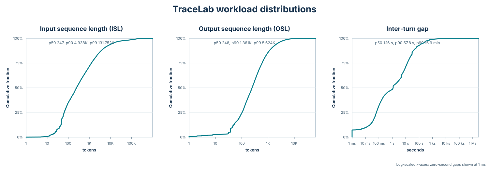
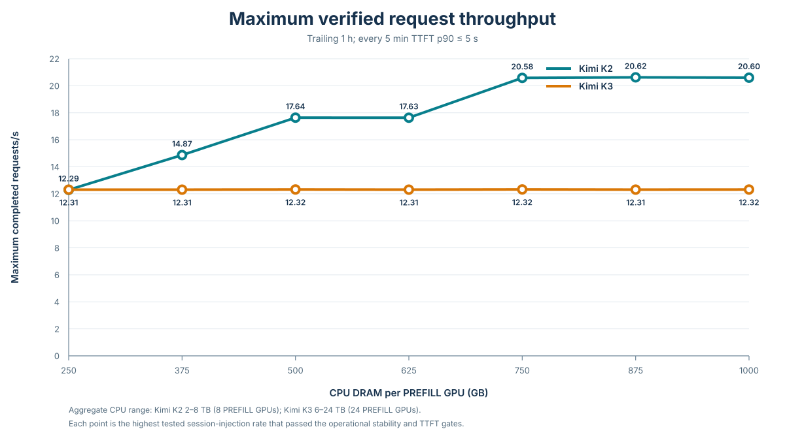

# 제3장. CPU DRAM 용량에 따른 KV 캐시 오프로딩 효과 평가

제1장과 제2장에서는 모델과 워크로드의 변화에 따라 rack-scale 추론 시스템의 메모리 요구량이 달라지며, 이를 분석하기 위한 Frontier의 구조와 시스템 모델을 설명하였다. 본 장에서는 Frontier를 이용하여 **CPU DRAM 용량이 inactive KV 캐시 보존과 서비스 수용량에 미치는 영향**을 평가한다.

## 3.1 평가 목적

Vera Rubin은 Vera CPU의 SOCAMM LPDDR5X와 Rubin GPU의 HBM을 NVLink-C2C로 연결하여 CPU DRAM을 GPU에 인접한 대용량 메모리 계층으로 활용할 수 있도록 설계되었다. NVIDIA가 공개한 최고 사양은 Vera CPU당 최대 1.5 TB의 LPDDR5X와 1.2 TB/s의 CPU 메모리 대역폭이다.[^nvidia-vera-rubin]

한편 2026년 6월 TrendForce는 LPDRAM 공급 상황에 따라 Vera Rubin Superchip의 표준 SOCAMM 탑재 용량이 당초 계획보다 축소될 수 있다고 보도하였다.[^socamm-reduction] 공식 최고 사양과 실제 제품의 탑재 구성을 구분할 필요가 있지만, CPU DRAM 용량이 비용과 공급 조건에 따라 달라질 수 있다는 점에서 용량 변화가 LLM 추론 성능에 미치는 영향을 사전에 검토할 필요가 있다.

본 장에서는 CPU DRAM의 활용 방법 중 **inactive KV 캐시 오프로딩**에 초점을 둔다. 에이전틱 워크로드에서는 도구 실행이나 사용자 입력을 기다리는 동안 세션의 KV 캐시가 즉시 사용되지 않을 수 있다. 이 상태를 CPU DRAM에 보존하면 GPU HBM에서 제거된 이후에도 후속 요청에서 기존 문맥을 재사용할 수 있다.

반대로 CPU DRAM 용량이 부족해 필요한 KV 캐시가 제거되면 후속 요청에서 기존 문맥의 PREFILL을 다시 수행해야 한다. 이는 추가 연산과 TTFT 증가로 이어지며, 부하가 높은 경우 PREFILL 대기열을 증가시켜 시스템의 수용량을 제한할 수 있다.

따라서 본 실험에서는 **CPU DRAM 용량을 변화시키면서 KV 캐시 보존율과 PREFILL 재계산량이 어떻게 달라지고, 그 결과 서비스 수준 목표를 만족할 수 있는 최대 부하가 어떻게 변화하는지**를 평가한다.

## 3.2 실험 구성

### 3.2.1 모델 및 시스템

평가 대상 모델은 Kimi K2와 Kimi K3로 선정하였다. 두 모델은 모두 대규모 MoE 구조이지만 모델 규모와 어텐션 구조가 다르며, 이에 따라 KV 상태의 크기와 구성 방식에도 차이가 있다.

Kimi K2는 61개 계층과 384개 expert를 가지며 모든 어텐션 계층에서 MLA(Multi-head Latent Attention)를 사용한다. Kimi K3는 93개 계층과 896개 expert로 규모가 증가하였고, token 수에 따라 증가하는 MLA KV와 세션 단위의 고정 상태를 사용하는 KDA 계층이 결합된 hybrid attention 구조를 사용한다.[^model-configs]

두 모델 모두 NVIDIA Vera Rubin NVL72의 공개 사양을 기반으로 한 analytical hardware model을 사용하였다. Rubin GPU당 288 GB HBM4와 22 TB/s HBM 대역폭, Vera CPU의 SOCAMM 및 NVLink-C2C 사양을 반영하였다. 실제 Rubin 장비의 kernel 측정값이 아닌 공개 사양 기반 모델이므로, 절대 성능값보다는 동일 조건에서 CPU DRAM 용량을 변경했을 때의 상대적 차이를 중심으로 해석한다.

서빙 구조는 PREFILL과 DECODE를 별도 GPU 그룹에서 처리하는 순차형 PDD(Prefill-Decode Disaggregation)를 사용하였다.

| 구분 | Kimi K2 | Kimi K3 |
| --- | --- | --- |
| PREFILL GPU | 8대 | 24대 |
| DECODE GPU | 16대 | 32대 |
| PREFILL 병렬화 | TP1·DP8·EP8 | TP1·PP24, pipeline-exclusive |
| DECODE 병렬화 | TP4·DCP4·DP4·EP16 | TP4·DCP4·DP8·EP32 |
| 어텐션 구조 | MLA | KDA·MLA hybrid |
| CPU KV cache 위치 | PREFILL 측 | PREFILL 측 |
| PREFILL batch token 상한 | 131,072 | 8,192 |
| Chunked PREFILL 크기 | 1,024 tokens | 512 tokens |

Kimi K3는 Kimi K2보다 계층과 expert 수가 많고 KDA·MLA 상태를 함께 처리하므로 더 많은 PREFILL 및 DECODE GPU를 사용하였다. 두 구성 모두 동일한 TraceLab 원본 데이터와 CPU KV 오프로딩 정책을 적용하였다.[^k2-config][^k3-config]

### 3.2.2 CPU DRAM 및 KV 오프로딩

CPU DRAM의 대역폭과 GPU 연결 구조는 Vera Rubin 사양을 사용하고, **CPU DRAM 용량만 독립적으로 변경**하였다.

하나의 Vera CPU가 두 개의 Rubin GPU와 연결되는 구조를 기준으로 CPU DRAM pool 하나를 두 GPU가 공유한다고 가정하였다. Frontier에서는 이를 GPU별 정적 slice로 나누어 각 PREFILL GPU가 동일한 CPU DRAM 용량과 대역폭을 사용하도록 모델링하였다.

CPU DRAM slice당 대역폭은 600 GB/s, NVLink-C2C 대역폭은 900 GB/s로 설정하였다. 물리 CPU 기준으로는 각각 1.2 TB/s와 1.8 TB/s에 해당하며, CPU DRAM 대역폭이 C2C보다 낮으므로 KV offload와 restore의 실효 전송 성능은 CPU DRAM 대역폭에 의해 제한된다.

본 실험에서는 용량 효과를 분리하여 평가하기 위해 설정된 CPU DRAM 전체를 KV cache 공간으로 사용할 수 있다고 가정하였다. 따라서 본문의 CPU DRAM 용량은 운영체제, tokenizer, control plane 및 기타 runtime이 사용하는 영역을 제외한 **KV cache 가용 용량**으로 해석한다.

PREFILL이 완료된 세션의 KV 캐시는 CPU DRAM에 저장한다. 후속 요청이 도착했을 때 필요한 KV가 GPU HBM에 존재하면 바로 재사용하고, GPU에는 없지만 CPU cache에 존재하면 GPU로 복원한다. CPU DRAM 용량이 부족한 경우에는 LRU(Least Recently Used) 정책에 따라 오래 사용되지 않은 KV부터 제거하며, 제거된 문맥이 다시 필요해지면 PREFILL에서 재계산한다.

```text
GPU hit  → GPU HBM의 KV 재사용
CPU hit  → CPU DRAM의 KV 복원
CPU miss → 기존 문맥 PREFILL 재계산
```

CPU DRAM 용량은 여러 단계로 sweep하되 GPU 수, CPU 및 GPU 메모리 대역폭, 모델 정밀도, scheduler 및 네트워크 설정은 고정하였다. 이를 통해 CPU DRAM 용량 변화가 KV 캐시 보존, PREFILL 재계산 및 서비스 수용량에 미치는 영향을 분리하여 평가한다.

### 3.2.3 워크로드

CPU KV 오프로딩의 효과는 세션의 문맥 길이와 요청 간격에 영향을 받는다. 문맥이 길수록 세션 하나를 보존하는 데 필요한 CPU DRAM이 증가하며, 요청 간격이 길수록 KV 캐시를 유지해야 하는 시간이 길어진다. 그 사이 다른 세션이 유입되면 LRU eviction이 발생할 가능성도 증가한다.

본 실험에서는 실제 코딩 에이전트 사용 과정에서 수집된 공개 trace인 TraceLab v0.0.2를 사용하였다.[^tracelab] TraceLab은 모델 호출별 ISL(Input Sequence Length), OSL(Output Sequence Length), 세션 내 요청 순서 및 도구 실행·사용자 입력에 따른 turn gap을 포함한다.



> **그림 3-1.** 실험에 사용한 TraceLab 워크로드의 ISL, OSL 및 동일 세션 내 turn gap 누적분포. 요청 길이와 turn gap이 넓은 범위에 분포하며, 긴 문맥과 긴 요청 간격은 KV 캐시의 메모리 점유 시간과 요구 용량을 증가시킨다.

모든 CPU DRAM 용량과 모델 구성에서 동일한 원본 trace, 세션 순서 및 seed를 사용하여 워크로드 차이가 비교 결과에 영향을 주지 않도록 하였다.

### 3.2.4 평가 방법

CPU DRAM 용량별 서비스 수용량을 평가하기 위해 **CPU DRAM 용량과 세션 주입률(session injection rate)을 함께 sweep**하였다. 세션 주입률은 초당 새로 시작되는 source session 수로 정의한다. 하나의 source session은 여러 turn과 LLM request를 포함하므로 session/s는 시스템에 유입되는 워크로드의 강도를 나타낸다.

CPU DRAM은 PREFILL GPU당 250, 375, 500, 625, 750, 875 및 1,000 GB로 변경하였고, 세션 주입률은 0.05 session/s부터 0.50 session/s까지 0.05 session/s 간격으로 sweep하였다. 각 구성에 대해 12시간의 가상 서비스 운영을 수행하고, 초기 상태의 영향을 줄이기 위해 마지막 1시간을 평가 구간으로 사용하였다.

서비스 수용 한계는 **마지막 1시간의 모든 5분 구간에서 TTFT p90이 5초 이하를 유지하는 가장 높은 시험 세션 주입률**로 정의하였다.

```text
최대 검증 세션 주입률
  = 모든 평가 구간에서 TTFT p90 ≤ 5초를 만족하는
    가장 높은 시험 세션 주입률
```

이 값은 연속적인 모든 부하에 대한 이론적 최대값이 아니라, 본 실험에서 sweep한 부하 중 서비스 수준 조건을 만족한 최대 검증값이다.

각 운용점에서는 다음 지표를 함께 측정한다.

- 최대 검증 세션 주입률(session/s)
- 완료 요청 처리량(requests/s)
- TTFT 및 TPOT
- GPU direct hit 및 CPU cache hit
- CPU cache 점유량 및 LRU eviction
- PREFILL 처리량, 사용률 및 대기열
- KV offload·restore 전송량 및 지연

이를 통해 CPU DRAM 용량 증가가 더 많은 inactive KV 캐시의 보존으로 이어지는지, 그리고 PREFILL 재계산 감소가 실제 서비스 수용량 및 완료 처리량 개선으로 연결되는지를 평가한다.

## 3.3 CPU DRAM 용량별 최대 요청 처리량

### 3.3.1 최대 검증 처리량

그림 3-2는 CPU DRAM 용량별로 서비스 수준 조건을 만족한 가장 높은 운용점의 완료 요청 처리량을 나타낸다. 각 점은 연속적인 이론 한계가 아니라 0.05 session/s 간격으로 시험한 부하 중 마지막 1시간의 모든 5분 구간에서 TTFT p90 5초 조건과 안정성 조건을 함께 만족한 최대 검증값이다.



> **그림 3-2.** PREFILL GPU당 CPU DRAM 용량에 따른 최대 검증 완료 요청 처리량. Kimi K2는 CPU DRAM 증가에 따라 처리량이 단계적으로 증가한 반면, Kimi K3는 시험한 250–1,000 GB/GPU 범위에서 약 12.31 requests/s로 유지되었다. 같은 GPU당 용량에서도 Kimi K3는 PREFILL GPU 수가 더 많으므로 aggregate CPU DRAM이 세 배라는 점에 유의해야 한다.

| CPU DRAM<br>(GB/PREFILL GPU) | Kimi K2 최대 부하<br>(session/s) | Kimi K2<br>(requests/s) | Kimi K3 최대 부하<br>(session/s) | Kimi K3<br>(requests/s) |
| ---: | ---: | ---: | ---: | ---: |
| 250 | 0.25 | 12.29 | 0.25 | 12.31 |
| 375 | 0.30 | 14.87 | 0.25 | 12.31 |
| 500 | 0.35 | 17.64 | 0.25 | 12.32 |
| 625 | 0.35 | 17.63 | 0.25 | 12.31 |
| 750 | 0.40 | 20.58 | 0.25 | 12.32 |
| 875 | 0.40 | 20.62 | 0.25 | 12.31 |
| 1,000 | 0.40 | 20.60 | 0.25 | 12.32 |

Kimi K2는 CPU DRAM을 250 GB/GPU에서 750 GB/GPU로 늘릴 때 최대 검증 처리량이 12.29 requests/s에서 20.58 requests/s로 약 67% 증가하였다. 750 GB/GPU 이후에는 추가 증가가 관찰되지 않았으며, 이는 본 workload와 부하 grid에서 Kimi K2의 CPU KV cache 용량 효과가 약 750 GB/GPU에서 포화되었음을 의미한다.

반면 Kimi K3는 250–1,000 GB/GPU의 모든 시험점에서 최대 검증 세션 주입률이 0.25 session/s였고, 완료 처리량도 12.31–12.32 requests/s로 사실상 동일하였다. 0.30 session/s에서는 동적인 backlog 증가 없이 요청을 처리할 수 있었지만 마지막 1시간의 5분 구간 TTFT p90 최댓값이 16.4–19.3초로 증가하여 서비스 수준 조건을 만족하지 못하였다. 따라서 Kimi K3에서는 **시험한 범위 내 CPU DRAM 추가 용량이 최대 검증 처리량을 높이지 못했다**고 해석할 수 있다.

이 결과는 NVIDIA의 Vera CPU 메모리 구성 변경과도 직접 비교할 수 있다. NVIDIA의 공개 Vera Rubin Superchip 구성은 Vera CPU 1개당 Rubin GPU 2개이며 CPU 메모리는 최대 1.5 TB이다. 이후 TrendForce는 NVIDIA가 LPDRAM 공급 부족에 대응해 Superchip당 SOCAMM 용량을 절반으로 축소하기로 했다고 보도하였다.[^nvidia-vera-rubin] [^socamm-reduction] 이를 1.5 TB에서 0.75 TB로의 변경으로 환산하면 Rubin GPU당 CPU DRAM은 750 GB에서 375 GB로 줄어들며, 이는 본 sweep의 두 시험점과 일치한다. Kimi K2에서는 이 변경에 해당하는 구간에서 최대 검증 처리량이 20.58 requests/s에서 14.87 requests/s로 27.7% 감소하였다. 반면 Kimi K3에서는 12.32 requests/s에서 12.31 requests/s로 차이가 0.1% 미만이었다. 따라서 **Kimi K3 결과는 본 workload와 시스템 가정 아래에서 0.75 TB 구성이 1.5 TB 구성과 동일한 최대 검증 처리량을 유지할 수 있음을 보여주며, 메모리 감축이 성능 관점에서도 가능한 선택이었음을 정량적으로 뒷받침한다.** 다만 이는 시뮬레이션에 의한 성능 타당성 검증이지 NVIDIA의 실제 의사결정 원인을 입증한 것은 아니며, 보도된 직접 원인은 LPDRAM 공급 제약이다.

### 3.3.2 Kimi K2와 Kimi K3의 용량 민감도 차이

두 모델의 차이는 CPU cache에 저장되는 KV 상태의 구성에서 확인할 수 있다. 두 실험 모두 KV 전송량 계산에 1 byte/element를 사용하므로 아래 차이는 정밀도 차이보다는 attention 구조와 PREFILL 병렬화 배치의 차이에서 발생한다. 본 실험 구성에서 16-token block 하나에 필요한 token-linear CPU KV 크기는 Kimi K2가 624,640 bytes, Kimi K3가 245,760 bytes이다. Kimi K3의 block당 KV 크기는 Kimi K2의 약 39.4%이다. 대신 Kimi K3는 KDA 상태를 위해 세션당 약 232 MB의 고정 snapshot을 추가로 저장한다.

| CPU KV 구성 | Kimi K2 | Kimi K3 |
| --- | ---: | ---: |
| Token-linear KV / 16-token block | 624,640 bytes | 245,760 bytes |
| 세션 고정 KDA snapshot | 없음 | 232,316,928 bytes |
| PREFILL GPU당 KV HBM budget | 185.38 GB | 191.66 GB |
| PREFILL GPU 수 | 8 | 24 |

동일한 세션 문맥 block 수를 `N`이라고 하면 본 구성의 CPU 저장량은 대략 다음과 같다.

```text
Kimi K2: 624,640 × N bytes
Kimi K3: 245,760 × N + 232,316,928 bytes
```

두 식의 교차점은 약 613 blocks, 즉 약 9.8K tokens이다. 따라서 문맥이 이보다 긴 TraceLab 세션에서는 KDA snapshot의 고정 비용을 포함하더라도 Kimi K3의 세션당 KV 상태가 Kimi K2보다 작아진다. Kimi K3는 PREFILL GPU도 24대로 Kimi K2의 8대보다 많기 때문에, 더 작은 token-linear KV와 더 큰 aggregate GPU HBM이 함께 작용하여 후속 turn의 prefix가 GPU에 남을 가능성이 높아진다.

동일한 0.25 session/s, 500 GB/GPU 운용점의 마지막 1시간을 비교하면 Kimi K2의 GPU direct hit는 84.45%이고 GPU miss에 대한 CPU conditional hit는 68.08%였다. 반면 Kimi K3의 GPU direct hit는 96.21%, CPU conditional hit는 4.22%였다. Kimi K2에서는 CPU DRAM이 GPU에서 제거된 prefix를 복원하는 실질적인 2차 cache로 동작하지만, Kimi K3에서는 대부분의 재사용 prefix가 GPU에 남아 CPU cache 용량 증가가 처리량으로 연결되지 않는다.

이 차이는 1.5 TB에서 0.75 TB로의 SOCAMM 감축이 Kimi K3에서 처리량 저하를 일으키지 않은 이유를 설명한다. Kimi K3는 token-linear KV가 Kimi K2의 39.4%이고 PREFILL GPU 수도 세 배이므로, 375 GB/GPU 구성에서도 재사용 가치가 높은 hot prefix의 대부분을 GPU HBM에 유지한다. 그 결과 CPU DRAM을 750 GB/GPU까지 늘려도 추가 공간은 주로 cold 또는 장시간 inactive 상태를 더 오래 보존할 뿐, 이미 96%를 넘는 GPU direct hit나 TTFT를 제한하는 PREFILL 실행·batching 조건을 개선하지 못한다. 반대로 Kimi K2는 GPU miss 후 CPU cache 복원에 실제로 의존하므로 같은 용량 감축이 처리량 손실로 이어진다. 즉 Kimi K3 결과는 NVIDIA의 공급망상 감축 원인을 설명하는 자료는 아니지만, **차세대 모델의 KV 상태 축소와 높은 HBM 상주율이 CPU 메모리 절반 감축의 성능 비용을 상쇄할 수 있다는 기술적 메커니즘**을 보여준다.

Kimi K3 결과에 대해 terminal session의 KV를 즉시 제거하고 다음 turn이 남은 세션만 유지하는 post-hoc oracle working-set 분석도 수행하였다. 500 GB/GPU 구성의 마지막 1시간에서 hot KV는 0.25 session/s일 때 GPU KV budget의 평균 27.9%, 최대 31.9%였고, model weight와 10% runtime reserve를 포함한 전체 HBM은 평균 52.0%, 최대 54.7%였다. 동적으로 안정적인 0.40 session/s에서도 전체 HBM은 평균 65.0%, 최대 70.2%였다. 이 결과는 Kimi K3의 서비스 수준 한계가 hot KV의 HBM 용량 부족보다는 PREFILL 실행 지연과 batching 조건에서 먼저 발생했음을 시사한다.

### 3.3.3 해석 범위와 설계 시사점

그림 3-2의 x축은 **PREFILL GPU당 CPU DRAM**이다. Kimi K2는 PREFILL GPU가 8대이므로 250–1,000 GB/GPU가 aggregate 2–8 TB에 해당하고, Kimi K3는 24대이므로 같은 범위가 aggregate 6–24 TB에 해당한다. 특히 Kimi K3의 최소 시험점인 250 GB/GPU는 aggregate 6 TB로, Kimi K2가 최대 처리량에 도달한 750 GB/GPU와 동일한 aggregate 용량이다. 따라서 본 결과만으로 Kimi K3가 Kimi K2보다 더 적은 **총 CPU DRAM**을 요구한다고 결론 내릴 수는 없다.

또한 두 모델은 PREFILL GPU 수와 병렬화 구조뿐 아니라 batch token 상한과 chunk 크기도 다르다. 그러므로 절대 처리량 차이를 KV 크기 하나의 효과로 해석해서는 안 된다. 본 실험이 직접 지지하는 결론은 다음과 같다.

- Kimi K2는 시험 범위에서 CPU DRAM 용량 증가가 GPU miss 이후의 CPU 복원율과 최대 요청 처리량 증가로 연결되었다.
- Kimi K3는 더 작은 token-linear KV, 24-GPU PREFILL pipeline 및 높은 GPU direct hit로 인해 250 GB/GPU 이상에서 추가 CPU DRAM의 한계효과가 관찰되지 않았다.
- 이는 CPU DRAM이 전혀 필요하지 않다는 의미가 아니라, **현재 시험의 최소점인 250 GB/GPU 아래와 CPU-off baseline을 측정해야 최소 필요 용량을 결정할 수 있다**는 의미이다.
- 모델 간 총 메모리 요구량을 비교하려면 GPU당 용량뿐 아니라 aggregate CPU DRAM, aggregate HBM, 세션당 KV bytes 및 동시 hot-session 수를 함께 정규화해야 한다.

따라서 Kimi K3의 후속 실험에서는 0–250 GB/GPU 구간을 더 세밀하게 sweep하고, terminal session KV 제거 정책을 적용한 경우와 기존 LRU 정책을 비교할 필요가 있다. 이 분석을 통해 CPU DRAM을 성능 향상을 위한 필수 cache tier로 볼 것인지, 장시간 유휴 세션을 위한 선택적 보존 계층으로 볼 것인지 구분할 수 있다.

---

[^nvidia-vera-rubin]: NVIDIA, [*Inside the NVIDIA Vera Rubin Platform: Six New Chips, One AI Supercomputer*](https://developer.nvidia.com/blog/inside-the-nvidia-rubin-platform-six-new-chips-one-ai-supercomputer/); NVIDIA, [*Vera Rubin NVL72 Specifications*](https://www.nvidia.com/en-sg/data-center/vera-rubin-nvl72/). 공개 사양은 preliminary이며 제품 구성에 따라 달라질 수 있다.

[^socamm-reduction]: TrendForce, [*NVIDIA Cuts Vera CPU Memory Configuration, Highlighting Persistent LPDRAM Supply Constraints and Rising Long-Term Demand*](https://www.trendforce.com/presscenter/news/20260610-13090.html), 2026-06-10. 본문에서는 NVIDIA의 공식 제품 사양이 아니라 시장조사기관의 공급망 보도로 구분하였다.

[^model-configs]: [`Kimi K2 model asset`](../../data/config/models/moonshotai__Kimi-K2-Instruct.json), [`Kimi K3 model asset`](../../data/config/models/moonshotai__Kimi-K3.json) 및 [`Kimi K3 support design`](../design/kimi-k3-support.md)를 기준으로 작성하였다.

[^k2-config]: [`Kimi K2 P8-D16 PREFILL-only configuration`](../../cpp/experiments/kimi_k2_cpu_dram/configs/tracelab_vera_rubin_p8_d16_prefill_only_cpu_per_gpu.json).

[^k3-config]: [`Kimi K3 P24-D32 PREFILL-only configuration`](../../cpp/experiments/kimi_k3_cpu_dram/configs/tracelab_k3_p24_d64_prefill_only_batch8192_cpu_per_gpu.json).

[^tracelab]: Kan Zhu et al., *TraceLab: Characterizing Coding Agent Workloads for LLM Serving*, 2026; TraceLab v0.0.2 dataset.
